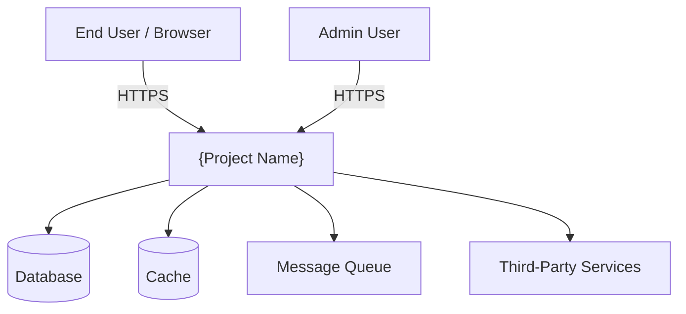
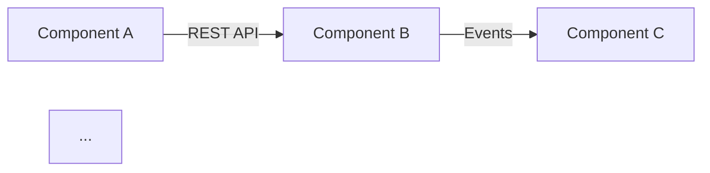
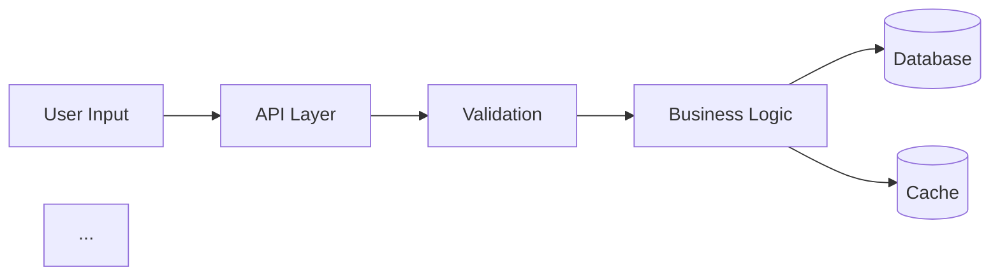
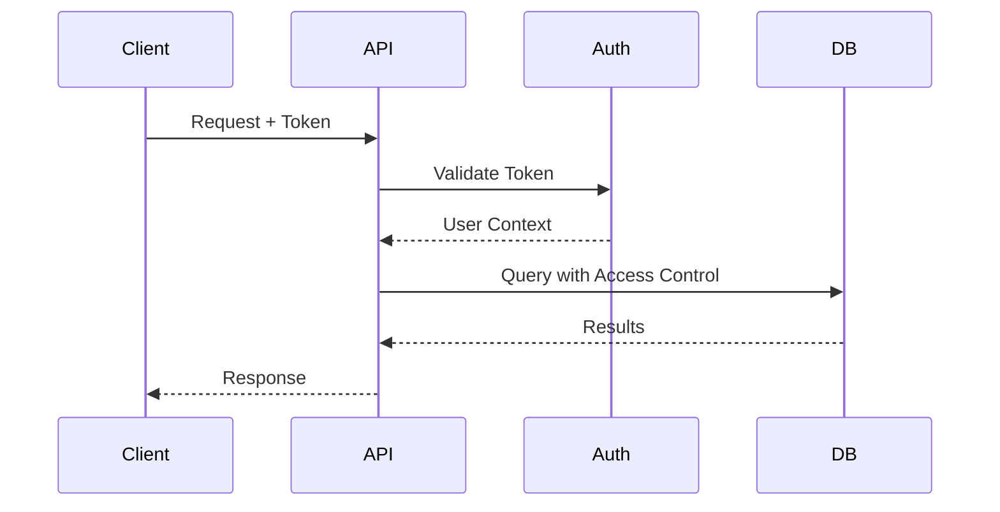
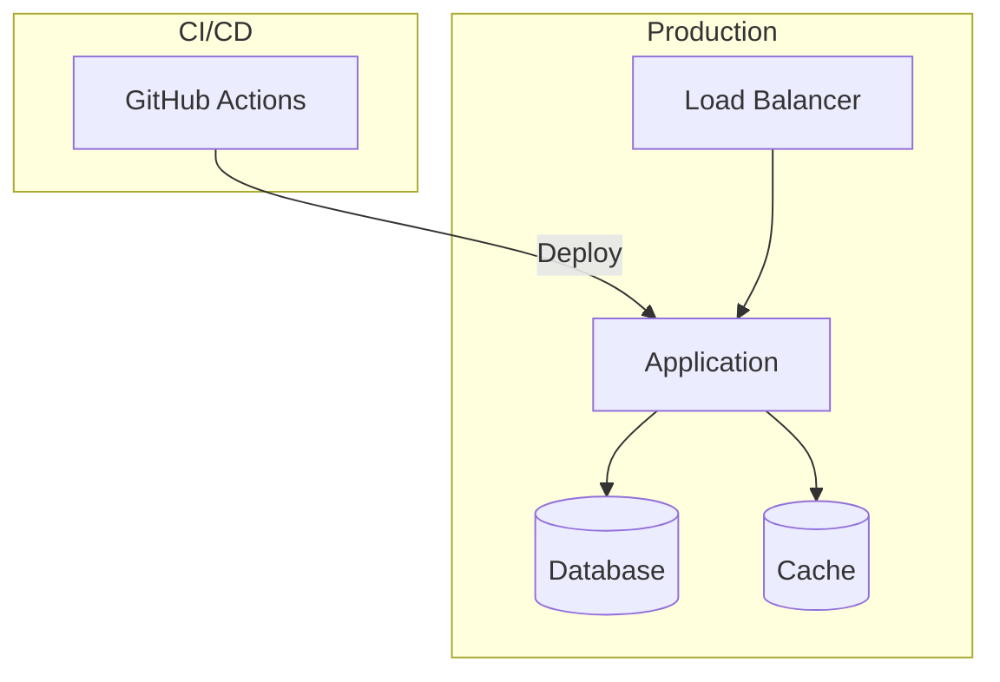
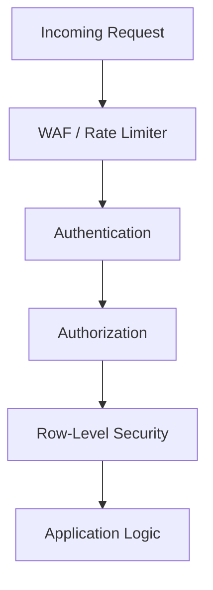
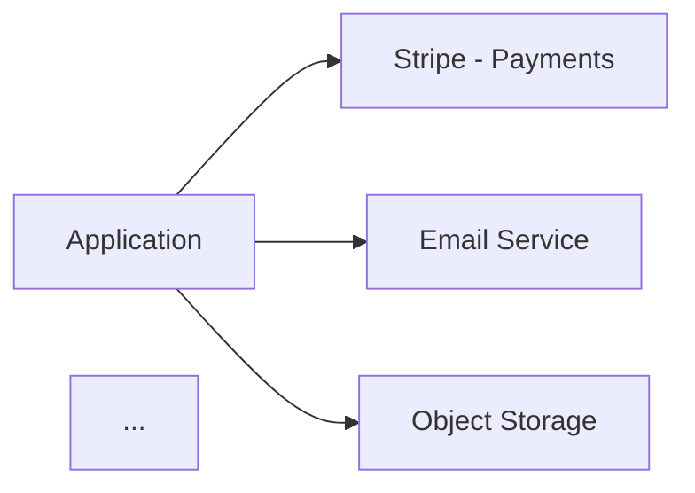

# Architecture — Software Architecture Document Generator

Generate, maintain, and export a comprehensive software architecture document for any project. Uses Mermaid diagrams for visual schemas. Keeps versioned backups and exports to PDF or DOCX via pandoc.

## Arguments

- `$1` (optional): Output format
  - `md` or empty: Generate/update markdown only
  - `pdf`: Generate markdown + export to PDF
  - `docx`: Generate markdown + export to Word
- `--force`: Regenerate from scratch even if a document exists

## Directory Structure

```
docs/architecture/
├── ARCHITECTURE.md          # Current version (always up to date)
├── .architecture-meta.json  # Metadata: last run, git SHA, version
├── backups/
│   ├── ARCHITECTURE.v3.md   # Most recent backup
│   ├── ARCHITECTURE.v2.md   # Previous
│   └── ARCHITECTURE.v1.md   # Oldest (rotated out when v4 is created)
└── exports/
    ├── ARCHITECTURE.pdf     # Latest PDF export
    └── ARCHITECTURE.docx    # Latest DOCX export
```

---

## Step 1: Check for Existing Document

```bash
# Check if architecture doc exists
ls docs/architecture/ARCHITECTURE.md 2>/dev/null
cat docs/architecture/.architecture-meta.json 2>/dev/null
```

**If `--force` argument is present:** Skip to Step 3 (full generation), regardless of existing doc.

**If document exists AND meta file exists:** Go to Step 2 (update mode).

**If no document exists:** Go to Step 3 (full generation).

---

## Step 2: Update Mode (Incremental)

When an existing architecture document is found, update it incrementally.

### 2a. Read metadata and determine what changed

```bash
# Read the last SHA from metadata
LAST_SHA=$(cat docs/architecture/.architecture-meta.json | python3 -c "import sys,json; print(json.load(sys.stdin)['last_git_sha'])")

# Get architectural changes since last run
git log $LAST_SHA..HEAD --oneline --stat
git diff $LAST_SHA..HEAD --stat
```

### 2b. Analyze changes for architectural impact

Spawn Explore agents in parallel to check what changed architecturally:

**Agent 1 — Structural Changes:**

- New directories, new route files, new services, new models
- Deleted components, renamed modules
- Changes to docker-compose, Dockerfile, CI/CD configs
- New dependencies in package.json / requirements.txt / go.mod

**Agent 2 — Schema & API Changes:**

- Database migration files added/modified
- New API routes or endpoints
- GraphQL schema changes
- New environment variables

### 2c. Classify changes

For each change, determine which architecture section it affects:

| Change Type                 | Affected Section            |
| --------------------------- | --------------------------- |
| New service/module          | Component Architecture      |
| New DB migration            | Data Architecture           |
| New API routes              | API Architecture            |
| Docker/K8s changes          | Infrastructure & Deployment |
| Auth changes                | Security Architecture       |
| New third-party integration | Integration Architecture    |
| Logging/monitoring changes  | Observability               |
| Major design choice         | Key Design Decisions        |

### 2d. Backup current version before updating

```bash
# Read current version number
CURRENT_VERSION=$(cat docs/architecture/.architecture-meta.json | python3 -c "import sys,json; print(json.load(sys.stdin)['version'])")

# Backup current doc
cp docs/architecture/ARCHITECTURE.md "docs/architecture/backups/ARCHITECTURE.v${CURRENT_VERSION}.md"

# Rotate backups — keep only last 3
cd docs/architecture/backups && ls -1 ARCHITECTURE.v*.md | sort -V | head -n -3 | xargs -r rm
```

### 2e. Update affected sections

Read the current `ARCHITECTURE.md`, then use Edit tool to update ONLY the sections affected by the changes. Do not rewrite unchanged sections.

After updating, also update any Mermaid diagrams that reference changed components.

### 2f. Update metadata

Write updated `.architecture-meta.json` with:

- New `last_git_sha` (current HEAD)
- Incremented `version`
- Current `generated_at` timestamp
- `update_summary` describing what changed

Go to Step 5 (Export).

---

## Step 3: Full Generation — Codebase Discovery

When generating from scratch, gather all architectural information first.

### 3a. Auto-detect tech stack

```bash
# Detect project type and tech stack
ls package.json pnpm-lock.yaml yarn.lock bun.lockb 2>/dev/null  # Node.js
ls requirements.txt pyproject.toml setup.py Pipfile 2>/dev/null  # Python
ls go.mod go.sum 2>/dev/null                                      # Go
ls Cargo.toml 2>/dev/null                                         # Rust
ls pom.xml build.gradle 2>/dev/null                               # Java
ls Gemfile 2>/dev/null                                            # Ruby
ls docker-compose*.yml Dockerfile* 2>/dev/null                    # Containers
ls .github/workflows/*.yml 2>/dev/null                            # CI/CD
ls terraform/ pulumi/ cdk/ 2>/dev/null                            # IaC
```

### 3b. Parallel codebase exploration

Spawn 4 Explore agents (model: haiku) in parallel:

**Agent 1 — Components & Structure:**

- Map all top-level directories and their purpose
- Identify services, apps, packages in monorepo
- Find entry points (main.py, index.ts, main.go, etc.)
- List major modules/packages and their dependencies on each other

**Agent 2 — Data & APIs:**

- Find database schema (migrations, ORM models, Prisma schema, etc.)
- Map API routes/endpoints (REST, GraphQL, gRPC)
- Identify data stores (SQL, NoSQL, cache, object storage, queues)
- Find auth/middleware configuration

**Agent 3 — Infrastructure & Security:**

- Read Dockerfiles, docker-compose, K8s manifests, Helm charts
- Find CI/CD configs (.github/workflows, .gitlab-ci, Jenkinsfile)
- Identify auth/authz patterns (JWT, OAuth, API keys, RBAC)
- Find encryption, secrets management, security middleware
- Read environment variable definitions (.env.example, config files)

**Agent 4 — Integrations & Observability:**

- Find third-party SDK imports (Stripe, Twilio, AWS, etc.)
- Identify webhook handlers
- Find logging configuration (Winston, Pino, structlog, etc.)
- Find monitoring/metrics (Prometheus, Datadog, Sentry, etc.)
- Find health check endpoints

### 3c. Compile findings

Wait for all agents to complete. Merge their findings into a unified architectural understanding before writing.

---

## Step 4: Write the Architecture Document

Create `docs/architecture/ARCHITECTURE.md` with the following sections. Every section is mandatory — if information is not found, write "Not detected — needs manual review."

### Document Structure

````markdown
---
title: "{Project Name} — Software Architecture"
version: 1
generated_at: "{ISO 8601 timestamp}"
git_sha: "{current HEAD SHA}"
---

# {Project Name} — Software Architecture

## Table of Contents

[Auto-generated from sections below]

---

## 1. Executive Summary

[One paragraph: what the system does, who it serves, key architectural style
(monolith, microservices, serverless, etc.), primary tech stack.]

---

## 2. System Overview

[High-level description of the system. How components relate.]

### System Context Diagram


````

### Tech Stack Summary

| Layer | Technology | Purpose |
| ----- | ---------- | ------- |
| ...   | ...        | ...     |

---

## 3. Component Architecture

[Each major component/service as a subsection]

### 3.1 {Component Name}

- **Responsibility:** What it does
- **Technology:** Framework, language, key libraries
- **Entry Point:** File path
- **Key Dependencies:** Other components it talks to

### Component Interaction Diagram



---

## 4. Data Architecture

### Data Stores

| Store | Technology | Purpose | Persistence |
| ----- | ---------- | ------- | ----------- |
| ...   | ...        | ...     | ...         |

### Entity Relationship Diagram (Key Entities)

```mermaid
erDiagram
    USER ||--o{ ORDER : places
    ORDER ||--|{ ORDER_ITEM : contains
    ...
```

### Data Flow Diagram



---

## 5. API Architecture

### API Style

[REST / GraphQL / gRPC / mixed]

### Authentication Flow



### Endpoint Summary

| Domain | Base Path | Methods | Auth Required |
| ------ | --------- | ------- | ------------- |
| ...    | ...       | ...     | ...           |

---

## 6. Infrastructure & Deployment

### Deployment Architecture



### Environments

| Environment | URL | Purpose |
| ----------- | --- | ------- |
| ...         | ... | ...     |

### Container Strategy

[Docker, K8s, serverless — whatever applies]

---

## 7. Security Architecture

### Authentication Model

[How users authenticate: JWT, OAuth, sessions, API keys]

### Authorization Model

[RBAC, ABAC, multi-tenant, RLS]

### Security Diagram



### Secrets Management

[How secrets are stored and accessed]

### Encryption

[At rest, in transit, application-level]

---

## 8. Integration Architecture

### Third-Party Services

| Service | Purpose | Integration Method |
| ------- | ------- | ------------------ |
| ...     | ...     | ...                |

### Integration Diagram



### Webhooks

| Webhook | Source | Endpoint | Purpose |
| ------- | ------ | -------- | ------- |
| ...     | ...    | ...      | ...     |

---

## 9. Observability

### Logging

[Framework, log levels, structured logging, log aggregation]

### Monitoring

[Health checks, metrics, dashboards]

### Alerting

[What triggers alerts, notification channels]

### Error Tracking

[Sentry, Bugsnag, etc.]

---

## 10. Key Design Decisions

Architecture Decision Records (ADR) format.

### ADR-001: {Decision Title}

- **Date:** YYYY-MM-DD
- **Status:** Accepted
- **Context:** Why this decision was needed
- **Decision:** What was decided
- **Consequences:** Trade-offs and implications

---

## Changelog

| Version | Date   | Changes            |
| ------- | ------ | ------------------ |
| 1       | {date} | Initial generation |

````

---

## Step 5: Export

### 5a. Ensure output directories exist

```bash
mkdir -p docs/architecture/backups docs/architecture/exports
````

### 5b. Write metadata file

Write `docs/architecture/.architecture-meta.json`:

```json
{
  "project": "{detected project name}",
  "version": 1,
  "generated_at": "{ISO 8601}",
  "last_git_sha": "{HEAD SHA}",
  "tech_stack": ["{detected technologies}"],
  "sections_updated": ["all"],
  "update_summary": "Initial generation"
}
```

### 5c. Render Mermaid Diagrams to SVG

Before exporting to PDF/DOCX, render all Mermaid code blocks to SVG images so they appear as actual diagrams in the final output.

```bash
mkdir -p docs/architecture/diagrams
```

Use a Python script to extract all `mermaid` code blocks from `ARCHITECTURE.md`, save each as a `.mmd` file, render to SVG via mmdc, then create `ARCHITECTURE-rendered.md` with `` tags pointing to the SVGs.

````python
import re, subprocess, os

src = "docs/architecture/ARCHITECTURE.md"
diagrams_dir = "docs/architecture/diagrams"
output = "docs/architecture/ARCHITECTURE-rendered.md"

with open(src) as f:
    content = f.read()

# Extract mermaid blocks, name by nearest heading
lines = content.split("\n")
blocks = []
i = 0
idx = 0
while i < len(lines):
    if lines[i].strip() == "```mermaid":
        heading = f"diagram-{idx}"
        for j in range(i - 1, max(i - 10, -1), -1):
            if lines[j].strip().startswith("#"):
                heading = re.sub(r'[^a-z0-9]+', '-', lines[j].strip().lstrip('#').strip().lower()).strip('-')
                break
        mermaid = []
        i += 1
        while i < len(lines) and lines[i].strip() != "```":
            mermaid.append(lines[i])
            i += 1
        name = f"{idx:02d}-{heading}"
        mmd_path = os.path.join(diagrams_dir, f"{name}.mmd")
        with open(mmd_path, "w") as f2:
            f2.write("\n".join(mermaid))
        # Render to SVG (run from /tmp to avoid pnpm workspace conflicts)
        svg_path = os.path.join(diagrams_dir, f"{name}.svg")
        subprocess.run(
            ["npx", "-y", "-p", "@mermaid-js/mermaid-cli", "mmdc",
             "-i", os.path.abspath(mmd_path), "-o", os.path.abspath(svg_path),
             "-t", "default", "-b", "white", "-w", "1200", "-q"],
            cwd="/tmp", timeout=30
        )
        blocks.append(name)
        idx += 1
    i += 1

# Replace mermaid code blocks with  tags in rendered markdown
bi = 0
def replace(m):
    global bi
    name = blocks[bi]; bi += 1
    abs_path = os.path.abspath(f"docs/architecture/diagrams/{name}.svg")
    return f''

rendered = re.sub(r'```mermaid\n.*?```', replace, content, flags=re.DOTALL)
with open(output, "w") as f:
    f.write(rendered)
````

**Important:** The `npx` call MUST use `-p @mermaid-js/mermaid-cli mmdc` syntax (not `@mermaid-js/mermaid-cli mmdc` directly) and should run from `/tmp` to avoid pnpm workspace conflicts.

### 5d. Export to PDF

Three-step pipeline: render Mermaid to SVG (5c above), pandoc converts rendered markdown to HTML, puppeteer renders to PDF.

```bash
# Step 1: Convert rendered markdown (with SVG images) to HTML
which pandoc || { echo "pandoc not found — install with: brew install pandoc"; exit 1; }

pandoc docs/architecture/ARCHITECTURE-rendered.md \
  -o docs/architecture/exports/ARCHITECTURE-rendered.html \
  --from markdown \
  --to html5 \
  --standalone \
  --toc \
  --toc-depth=3 \
  --metadata title="{Project Name} — Software Architecture" \
  --metadata date="$(date +%Y-%m-%d)" \
  --css=https://cdn.jsdelivr.net/npm/water.css@2/out/water.min.css \
  2>&1

# Step 2: Render HTML to PDF with puppeteer (renders SVG diagrams natively)
NODE_PATH=/opt/homebrew/lib/node_modules node -e "
const puppeteer = require('puppeteer');
const path = require('path');
(async () => {
  const browser = await puppeteer.launch({ headless: 'new' });
  const page = await browser.newPage();
  const htmlPath = 'file://' + path.resolve('docs/architecture/exports/ARCHITECTURE-rendered.html');
  await page.goto(htmlPath, { waitUntil: 'networkidle0', timeout: 20000 });
  await page.pdf({
    path: 'docs/architecture/exports/ARCHITECTURE.pdf',
    format: 'A4',
    margin: { top: '1.5cm', right: '1.5cm', bottom: '1.5cm', left: '1.5cm' },
    printBackground: true,
    displayHeaderFooter: true,
    headerTemplate: '<div style=\"font-size:8px;text-align:right;width:100%;padding-right:1.5cm;color:#666\">{Project Name} — Software Architecture</div>',
    footerTemplate: '<div style=\"font-size:8px;text-align:center;width:100%;color:#666\"><span class=\"pageNumber\"></span> / <span class=\"totalPages\"></span></div>'
  });
  await browser.close();
  console.log('PDF generated successfully');
})();
" 2>&1
```

If puppeteer is not installed, install it: `npm install -g puppeteer`

If both pandoc and puppeteer fail, fall back to DOCX-only export.

### 5e. Export to DOCX (if specifically requested, or as fallback)

### 5d. Export to DOCX (if specifically requested, or as fallback)

```bash
pandoc docs/architecture/ARCHITECTURE.md \
  -o docs/architecture/exports/ARCHITECTURE.docx \
  --from markdown \
  --to docx \
  --toc \
  --toc-depth=3 \
  --metadata title="{Project Name} — Software Architecture" \
  --metadata date="$(date +%Y-%m-%d)" \
  2>&1
```

Note: Mermaid code blocks will appear as code in DOCX/PDF since pandoc doesn't render them natively. The `.md` file is the primary artifact — use a Mermaid-compatible viewer (GitHub, VS Code with extension, or MkDocs) for rendered diagrams.

---

## Step 6: Report Results

### First Run Output

```
Architecture document generated!

📄 Markdown: docs/architecture/ARCHITECTURE.md
📦 Export:   docs/architecture/exports/ARCHITECTURE.{pdf|docx}
📋 Meta:     docs/architecture/.architecture-meta.json

Version: 1
Sections: 10
Diagrams: {N} Mermaid diagrams

Tech stack detected: {list}

To view with rendered diagrams, open the .md in VS Code
with the Mermaid extension or push to GitHub.
```

### Update Run Output

```
Architecture document updated!

📄 Updated:  docs/architecture/ARCHITECTURE.md
💾 Backup:   docs/architecture/backups/ARCHITECTURE.v{N}.md
📦 Export:   docs/architecture/exports/ARCHITECTURE.{pdf|docx}

Version: {N} → {N+1}
Changes since {last_date} ({commit_count} commits):
  - {section}: {what changed}
  - {section}: {what changed}

Backups retained: v{N}, v{N-1}, v{N-2}
```

---

## Rules

1. **Never fabricate architecture.** Every claim must be traceable to actual code found in the codebase. If something is unclear, write "Not detected — needs manual review."
2. **Mermaid diagrams must be accurate.** Only include components, services, and connections that actually exist in the code. Do not add aspirational architecture.
3. **Keep backups strictly to 3.** After creating a new backup, always rotate out the oldest if there are more than 3.
4. **Update mode is surgical.** Only modify sections affected by actual code changes. Do not rewrite the entire document on updates.
5. **The .md file is the source of truth.** PDF/DOCX exports are convenience copies. Always generate the .md first.
6. **Respect project conventions.** If the project already has a `docs/` directory, use it. If it uses a different documentation structure, adapt.
7. **ADRs accumulate.** In update mode, add new ADRs for significant decisions — never remove or modify existing ones (they are historical records).
